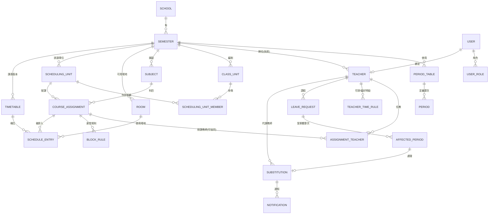
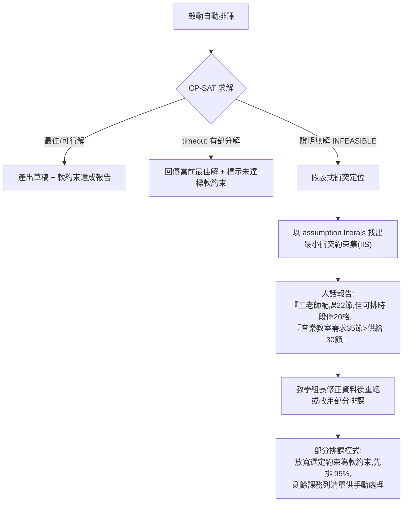
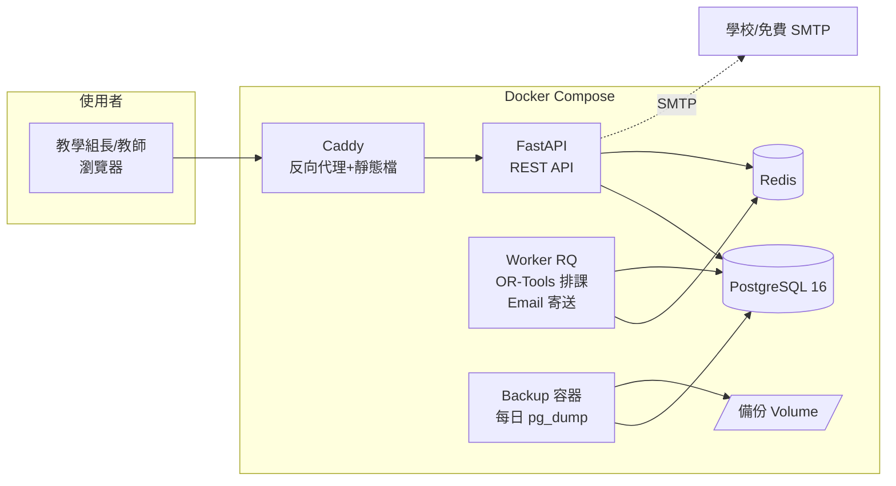
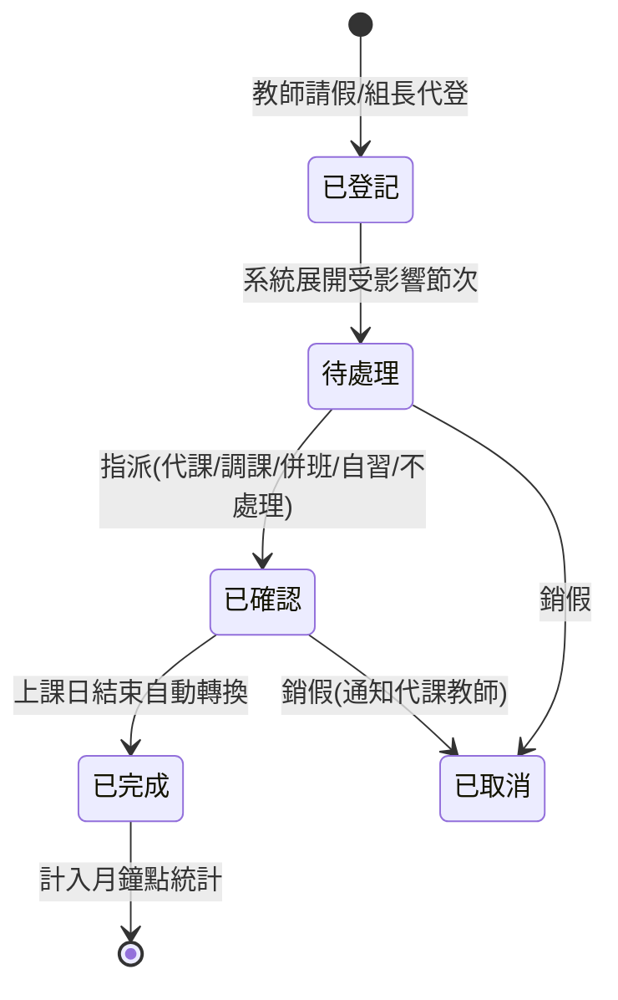

# 排課與調代課系統 — 架構規劃文件

> 版本:v1.0(2026-07-07)
> 狀態:規劃定稿,交棒開發依據 [tasks.md](tasks.md)
> 授權:MIT
> 已定技術棧:**Python 3.12 + FastAPI + OR-Tools CP-SAT + Vue 3 + PostgreSQL 16 + Docker Compose**

---

## 0. 專案定位

一套**開源免費、單校自架、純 Web** 的排課與調代課系統,服務對象為全國國小、國中、普通型高中、綜合型高中、技術型高中的**教學組長**(主要操作者)、教務主任(審核/查看)與一般教師(查課表、請假、接代課通知)。

三大設計原則(所有後續決策的最高準則):

1. **不寫死學制**:五種學制的差異一律化約為「可設定的資料」(自訂節次表、彈性排課單位、可調約束),而非分支程式邏輯;以「學制範本」讓使用者一鍵初始化。
2. **一鍵部署**:`docker compose up -d` 一行指令完成安裝;所有維運(備份、還原、升級)都有 UI 按鈕或單行指令。
3. **30 分鐘上手**:首次登入進入「設定精靈」,一步一步完成建置;所有畫面使用台灣教務慣用語(節次、科任、配課、鐘點)。

---

## 1. 需求規格書

### 1.1 使用者角色與權限矩陣

| 功能 | 系統管理員 | 教學組長 | 教務主任 | 教師 |
|---|---|---|---|---|
| 系統設定、帳號管理、備份還原 | ✅ | — | — | — |
| 基礎資料維護(節次表/教師/班級/科目/場地) | ✅ | ✅ | 檢視 | — |
| 配課與排課(手動+自動) | ✅ | ✅ | 檢視 | — |
| 課表發布 | ✅ | ✅ | 核可(可設定是否需要) | — |
| 調代課安排 | ✅ | ✅ | 檢視 | 回應代課邀請 |
| 請假登記 | ✅ | ✅(可代登) | 檢視 | ✅(登記本人) |
| 查詢課表(班級/教師/場地) | ✅ | ✅ | ✅ | ✅(全校可見或僅本人,可設定) |
| 鐘點統計報表 | ✅ | ✅ | ✅ | 僅本人 |

- 角色採 RBAC,一人可兼多角色(例:教學組長同時是教師)。
- 「教務主任核可」為可開關的流程節點,預設關閉(多數學校由教學組長直接發布)。

### 1.2 User Story 清單

優先級:**MVP**(M0–M5 必做)/ **v2** / **v3**。

#### A. 系統建置與基礎資料

| # | User Story | 優先級 |
|---|---|---|
| A1 | 身為資訊組長,我能用一行 Docker 指令架好系統,並用預設管理員帳號登入 | MVP |
| A2 | 身為教學組長,首次登入有設定精靈:選學制範本 → 設定學年學期 → 自訂節次表 → 匯入教師/班級/科目 → 完成 | MVP |
| A3 | 身為教學組長,我能自訂節次表(每天節數、每節起訖時間、午休、早自習、週三下午不排課等) | MVP |
| A4 | 身為教學組長,我能用 Excel 範本批次匯入教師(姓名、任教科目、基本鐘點、行政職減課)與班級 | MVP |
| A5 | 身為教學組長,我能維護場地(普通教室、專科教室、實習工場,含容量與適用科目) | MVP |
| A6 | 身為管理員,我能批次建立教師帳號並發送啟用通知 | MVP |
| A7 | 身為教學組長,我能開新學期並複製上學期的基礎資料(教師/班級/科目/節次表) | MVP |
| A8 | 身為管理員,我能整合教育雲端帳號(OpenID Connect)登入 | v2 |

#### B. 配課

| # | User Story | 優先級 |
|---|---|---|
| B1 | 身為教學組長,我能建立配課:排課單位 × 科目 × 教師(可多位協同)× 每週節數 × 連堂規則 × 場地需求 | MVP |
| B2 | 身為教學組長,我能建立「跑班群組」(多班聯排,如高中多元選修、綜高學程),群組內課程同時段開課 | MVP |
| B3 | 身為教學組長,我能看到每位教師的配課節數統計,即時對照基本鐘點(超鐘點/不足以顏色標示) | MVP |
| B4 | 身為教學組長,我能用 Excel 批次匯入配課資料 | MVP |
| B5 | 身為教學組長,我能設定教師「不可排課時段」(兼行政、公假、進修)與「偏好時段」 | MVP |

#### C. 排課

| # | User Story | 優先級 |
|---|---|---|
| C1 | 身為教學組長,我能在週課表格子上以拖拉方式手動排課,衝突格位即時以紅色提示並說明原因 | MVP |
| C2 | 身為教學組長,我能切換班級/教師/場地三種課表視角 | MVP |
| C3 | 身為教學組長,我能一鍵自動排課,看到進度,並在完成後看到軟約束達成度報告 | MVP |
| C4 | 身為教學組長,我能「鎖定」部分格位(如已敲定的科任時段),自動排課不得移動 | MVP |
| C5 | 身為教學組長,自動排課無解時,系統告訴我最可能衝突的約束(如「王老師配課 22 節但可排時段僅 20 格」) | MVP |
| C6 | 身為教學組長,我能保留多個課表草稿版本,比較後選一個發布 | MVP |
| C7 | 身為教學組長,發布後全校師生可查詢課表 | MVP |
| C8 | 身為教學組長,我能對已發布課表做局部調整並重新發布(保留歷次版本) | MVP |
| C9 | 身為教學組長,我能設定進階軟約束權重(科目分佈均勻、教師空堂集中等) | v2 |

#### D. 調代課

| # | User Story | 優先級 |
|---|---|---|
| D1 | 身為教師,我能登記請假(日期範圍、假別),系統自動列出受影響節次 | MVP |
| D2 | 身為教學組長,我能替教師代登請假 | MVP |
| D3 | 身為教學組長,對每一受影響節次,我能選擇處理方式:代課/調課(對調)/併班/自習/公假不處理 | MVP |
| D4 | 身為教學組長,系統推薦可代課教師(該時段空堂 → 同科目優先 → 當日已在校 → 代課鐘點平衡),一鍵指派 | MVP |
| D5 | 身為被指派教師,我會收到站內通知與 Email,可一鍵「確認收到」(實務上組長指派前已口頭徵得同意,故**不設婉拒流程**,2026-07-09 使用者定案) | MVP |
| D6 | 身為教學組長,我能看到每筆代課通知的確認狀態,對未確認者一鍵再次提醒 | MVP |
| D7 | 身為教學組長,我能查看任一日期的「今日調代課看板」,列印當日調代課通知單 | MVP |
| D8 | 身為教學組長,我能設定調課(甲乙教師對調兩節課),系統驗證雙方均無衝突 | MVP |
| D9 | 身為教學組長,月底我能匯出代課鐘點統計表(依教師、依假別、依經費來源) | MVP |
| D10 | 身為教師,我能在手機瀏覽器順利完成「查課表、請假、確認代課」 | MVP |
| D11 | 系統可介接校內差勤系統自動帶入假單 | v3 |

#### E. 報表與整合

| # | User Story | 優先級 |
|---|---|---|
| E1 | 我能匯出班級/教師/場地課表為 Excel、PDF、PNG(A4 直式,適合公告欄張貼) | MVP |
| E2 | 我能匯出全校總課表(大表)Excel | MVP |
| E3 | 系統每日自動備份資料庫,管理員可一鍵下載備份檔、一鍵還原 | MVP |
| E4 | 系統提供 OpenAPI 文件,供校務系統介接(唯讀課表 API) | v2 |
| E5 | 通知支援 webhook(供學校自行串接 LINE 官方帳號、Teams 等) | v2 |

### 1.3 各學制差異對照表

| 差異點 | 國小 | 國中 | 普高 | 綜高 | 技高 | 系統對應機制 |
|---|---|---|---|---|---|---|
| 節次結構 | 40 分/節,週三下午空 | 45 分/節 | 50 分/節 | 50 分/節 | 50 分/節 | **自訂節次表** + 全校性「不排課時段」 |
| 授課型態 | 導師包班+科任 | 領域專任 | 專任+跑班選修 | 學程跑班 | 群科+實習 | **配課**皆為「排課單位×科目×教師」,包班=同一教師大量配課 |
| 跑班 | 無 | 少(彈性課程) | 多元選修、加深加廣 | 學術/專門學程 | 部分專業科目 | **跑班群組**(多班聯排同時段) |
| 連堂 | 少 | 少 | 實驗課 2 連堂 | 專門學程實習 | 實習課 2–4 連堂 | 配課的**連堂規則**(N 連堂 × 每週 M 次) |
| 場地限制 | 專科教室 | 專科教室 | 實驗室 | 實習場所 | **實習工場容量是硬限制** | 場地類型+容量,排入硬約束 |
| 特殊時段 | 導師時間、晨光 | 週會、社團 | 團體活動、彈性學習 | 同普高 | 同普高 | 節次表可標記「固定用途時段」不參與排課 |
| 教師特例 | 科任跨多班 | 跨年級 | 兼行政減課 | 跨學程 | 業界師資僅特定時段到校 | 教師「**可排課時段**」白名單 |

> 結論:五學制差異全部收斂為 4 個可設定機制 —— **自訂節次表、彈性排課單位(班級/跑班群組)、連堂規則、可排時段限制**。系統出廠附五種學制範本(預填節次表與科目清單),使用者可再修改。

**混合學制學校(M0 後補充,2026-07-09)**:學制標籤掛在**班級**(`class_units.track`)而非學校,因此完全中學(國中部+高中部)、普高+綜高並存(如南大附中)、技高附設普通科、K-12 實驗學校等混合型學校天然支援——同一學期內各班級各掛各的學制標籤、各用各的節次表。配套要求:
1. `class_units.period_table_id`(nullable,空=學期預設節次表)——**每個班級必須可指定所屬節次表**,排課引擎與衝突檢查據此取得該班合法時段(任務卡 M1-6);
2. 進修部/夜間部以「另一套節次表」處理,不引入新學制標籤;
3. 建學期僅帶入一個主要範本;第二學制的節次表由「新增節次表選範本」建立,科目以 Excel 匯入補齊(範本科目合併帶入列 v2)。

### 1.4 Out of Scope(明確不做)

- ❌ 成績管理、學籍管理、差勤簽核(僅接收請假事實,不做假單簽核流程)
- ❌ 多校共用 SaaS、跨校資料交換
- ❌ 學生選課系統(選課結果以 Excel 匯入跑班群組名單;選課過程不在本系統)
- ❌ 原生 App(以響應式 Web 支援手機/平板)
- ❌ 大學/幼兒園學制
- ❌ 薪資計算(只產出代課鐘點統計表,計薪由人事/會計系統處理)

---

## 2. 領域模型與資料庫設計

### 2.1 ER 圖



### 2.2 核心實體定義

| 實體 | 說明 | 關鍵欄位 |
|---|---|---|
| `school` | 單校設定(單筆) | 校名、學制類型(可複選,如完全中學)、Logo、通知設定 |
| `semester` | 學年學期 | 學年度(如 115)、學期(1/2)、起訖日、狀態(準備中/進行中/已封存) |
| `period_table` | 節次表 | 名稱;一學期可有多套(如高中部/國中部各一套) |
| `period` | 節次定義 | 星期(1–5,可擴至 6)、第幾節、起訖時間、類型(一般課/早自習/午休/導師時間/固定用途) |
| `teacher` | 教師 | 姓名、任教科目(多)、基本鐘點、行政職稱與減課數、是否外聘/業界師資、在職狀態、聯絡資訊(Email/手機/LINE ID,皆選填)、綁定帳號(`user_id`,nullable FK → users) |
| `class_unit` | 班級 | 年級、班名、學制標籤(普/綜/技/國中/國小)、群科(技高)、導師、人數 |
| `subject` | 科目 | 名稱、領域/群別、需要場地類型、預設連堂規則 |
| `room` | 場地 | 名稱、類型(普通/專科/實習工場/戶外)、容量、適用科目 |
| `scheduling_unit` | **排課單位**(關鍵抽象) | 類型:`single`(單一班級)/`group`(跑班群組);跑班群組透過 `scheduling_unit_member` 關聯多個班級 |
| `course_assignment` | **配課** | 排課單位、科目、每週節數、場地需求(類型或指定場地)、是否鎖定場地 |
| `assignment_teacher` | 配課教師 | 支援協同教學(多教師);主教/協同標記 |
| `block_rule` | 連堂規則 | 連堂長度(2–4)、每週次數(如「每週 6 節,其中 3 連堂×2 次」) |
| `teacher_time_rule` | 教師時段規則 | 類型:`unavailable`(硬:不可排)/`avoid`(軟:盡量避開)/`prefer`(軟:偏好);對應星期×節次 |
| `timetable` | 課表版本 | 狀態:`draft` / `published` / `archived`;同學期可多份草稿,僅一份 published |
| `schedule_entry` | 課表格位 | 課表版本、配課、星期、節次、場地、`locked` 旗標;**唯一性約束在應用層+求解器驗證**(教師/班級/場地同時段不重複) |
| `leave_request` | 請假 | 教師、假別(公/事/病/婚/喪/產/進修)、起訖日期時間、事由、登記人 |
| `affected_period` | 受影響節次 | 請假展開後的每一節課;狀態機見 §5.3 |
| `substitution` | 調代課處置 | 類型:`substitute`(代課)/`swap`(調課)/`merge`(併班)/`self_study`(自習)/`cancel`(不處理);代課教師、是否計鐘點、經費來源標記 |
| `notification` | 通知 | 站內+Email(v2 經 channel adapter 加 LINE/webhook);類型、收件人、已讀狀態 |
| `user` / `user_role` | 帳號與角色 | 本地帳密(bcrypt);角色:admin / director(教務主任)/ scheduler(教學組長)/ teacher |
| `audit_log` | 操作軌跡 | 誰在何時改了什麼(排課異動、調代課指派必記) |

### 2.3 關鍵設計決策

**D1|「排課單位」抽象是支撐五學制的核心。**
排課的最小單位不是「班級」而是 `scheduling_unit`。單一班級的課 → `single`;跑班選修(3 個班同時段拆成 5 組上不同課)→ 建一個 `group` 含 3 個班,群組內的多筆配課由求解器強制排在同一時段。國小包班 = 導師在自己班的大量 `single` 配課,無需特殊邏輯。

**D2|節次表資料化,絕不寫死。**
「週三下午不排課」「第 8 節只有高三上」這類規則,全部以 `period.type` 與教師/班級的時段規則表達。完全中學(國中部+高中部節次時間不同)以多套 `period_table` 支援——這是市售系統常見痛點,必須在 schema 層解決。

**D3|學期快照,不做跨學期外鍵。**
教師、班級、配課皆隸屬於 `semester`。開新學期用「複製精靈」拷貝資料,而非共用主檔——避免「教師去年任教科目變動污染歷史課表」的經典錯誤。跨學年報表用姓名+身分證末四碼(可選填)做軟性對應。

**D4|課表版本化。**
`timetable` 支援多草稿並存與發布快照。學期中調整 = 複製 published 為新 draft → 修改 → 重新發布,舊版自動 archived。調代課紀錄掛在 published 版本上,不受草稿影響。

**D5|單校 schema,不做 multi-tenant。**
無 `tenant_id`。但所有查詢一律以 `semester_id` 為範圍,天然支援多學期並存與歷史保存。

**D6|時區與日期時間政策(M0 健檢新增)。**
三類時間嚴格區分,不得混用:
1. **系統時間戳**(created_at、locked_until、通知時間)→ `DateTime(timezone=True)`,一律 UTC aware;
2. **領域日期**(學期起訖、請假日期、調代課日期)→ `Date`,無時區概念;
3. **領域時間**(節次起訖時間)→ `Time`,即學校牆鐘時間,無時區概念。
「今日/本週」等判定以 `.env` 的 `TZ`(預設 `Asia/Taipei`)換算,不用 UTC 直接取日期。SQLite(測試)回傳 naive datetime 的差異,統一在讀取層正規化為 UTC。

**D7|跨節次表的資源衝突以「牆鐘時間重疊」判定(M1 健檢新增,2026-07-09)。**
教師(H2)與場地(H3)是跨班級共用的資源;當兩堂課所屬班級使用**不同節次表**時,節次號相同不代表時間相同、節次號不同也可能時間重疊(例:國小部 40 分/節的第 4 節 10:30–11:10,與高中部 50 分/節的第 3 節 10:10–11:00 重疊)。因此:
1. 衝突檢查與 CP-SAT 建模中,教師/場地的「同時段」定義 = **同星期且兩節次的起訖時間區間重疊**;兩班同節次表時退化為 `period_no` 相等(常見情形,零額外成本);
2. 實作上預先計算「節次表兩兩之間的節次重疊矩陣」(每學期節次表數 ≤ 個位數,矩陣極小),衝突檢查仍可達 <100ms;
3. 班級不衝堂(H1)只涉及單一班級自身的節次表,維持 `period_no` 判定;
4. **跑班群組的成員班級必須使用同一節次表**(否則 H7「同時段開課」無意義),配課建立時驗證並拒絕。

---

## 3. 排課引擎設計

### 3.1 問題建模

排課 = 對每筆配課的每一節,指派一個(星期×節次)時段與場地,滿足所有硬約束並最大化軟約束加權分數。這是經典的 **School Timetabling Problem**,採 **Google OR-Tools CP-SAT** 求解。

**決策變數**:`x[a, s] ∈ {0,1}` — 配課 a 的課排在時段 s;連堂以「起始時段變數 + 區間佔用」建模。場地在需求非唯一時另設 `r[a, s, room]` 變數,佔多數的「固定場地」(班級教室)則預先綁定以縮小搜尋空間。

### 3.2 約束條件分類

**硬約束(違反即無效解)**

| 編號 | 約束 | 說明 |
|---|---|---|
| H1 | 班級不衝堂 | 同一班級(含所屬跑班群組)同時段至多一門課 |
| H2 | 教師不衝堂 | 同一教師同時段至多一門課(含協同) |
| H3 | 場地不衝堂 | 同一場地同時段至多一門課;實習工場容量限制 |
| H4 | 教師不可排時段 | `teacher_time_rule.unavailable`(兼行政、業界師資到校日、公假) |
| H5 | 節次有效性 | 只能排在 `period.type = 一般課` 的時段 |
| H6 | 連堂完整性 | 連堂課必須連續且不跨午休 |
| H7 | 跑班同步 | 同一跑班群組的所有配課排在同一時段 |
| H8 | 週節數守恆 | 每筆配課排入的節數 = 設定的每週節數 |
| H9 | 鎖定格位 | `schedule_entry.locked` 的格位不得移動 |
| H10 | 每日科目上限 | 同班同科目每日至多 N 節(預設 2,連堂除外,可設定) |

**軟約束(加權計分,權重可調)**

| 編號 | 約束 | 預設權重 |
|---|---|---|
| S1 | 教師偏好時段(prefer 加分 / avoid 扣分) | 中 |
| S2 | 同班同科目分散於不同日 | 高 |
| S3 | 教師每日授課節數上限(預設 ≤6) | 高 |
| S4 | 教師空堂集中(減少零碎空堂) | 低 |
| S5 | 主科(可標記)優先排上午 | 中 |
| S6 | 教師連續授課 ≤3 節 | 中 |
| S7 | 導師的課優先排在自己班的第一節(國中小) | 低 |
| S8 | 全校教師偏好達成率的公平性(最差者優先) | 低 |

### 3.3 選型理由與效能預估

- **CP-SAT 而非基因演算法/模擬退火**:CP-SAT 對硬約束是「證明式滿足」,不會產生違反硬約束的解;GA/SA 需自行調參且無法證明無解。CP-SAT 為 anytime solver,隨時可中斷取當前最佳解,天然支援「進度條+提前結束」。
- **規模預估**:60 班 × 35 節 ≈ 2,100 節課,變數量 10⁵ 級,CP-SAT 在 4 核心機器約 1–5 分鐘可得高品質解(業界同類系統實證區間)。預設 timeout 10 分鐘,可設定。
- **執行架構**:求解跑在獨立 worker 容器(RQ + Redis 佇列),不阻塞 Web;進度以 polling API 回報(每 5 秒),避免 WebSocket 增加部署複雜度。

### 3.4 無解與降級策略



- **衝突定位是本系統的差異化重點**:市售系統只回「排不出來」,本系統利用 CP-SAT 的 assumption 機制,將每類硬約束掛 assumption literal,無解時取 unsat core 轉譯成教務語言的具體建議。
- **事前檢查(pre-flight check)**:排課前先跑廉價的必要條件檢查(每位教師配課數 ≤ 可排時段數、每場地需求 ≤ 供給、每班週節數 ≤ 可用節次),攔截 80% 的資料錯誤,不浪費求解時間。

---

## 4. 技術架構

### 4.1 技術選型

| 層 | 選型 | 理由 |
|---|---|---|
| 前端 | **Vue 3 + TypeScript + Vite + Pinia + Naive UI** | 台灣社群 Vue 使用率高、學習曲線平緩,對兼職開源貢獻者友善;Naive UI 元件完整且 TypeScript 原生 |
| 課表互動 | 自製 CSS Grid 課表 + HTML5 Drag & Drop(封裝為 `TimetableGrid` 元件) | 課表拖拉邏輯高度領域化,通用套件反而綁手腳 |
| 後端 | **Python 3.12 + FastAPI + SQLAlchemy 2.0 + Alembic + Pydantic v2** | 與 OR-Tools 同語言;FastAPI 自帶 OpenAPI 文件(滿足 E4);型別完整 |
| 排課引擎 | **OR-Tools CP-SAT**(獨立 `solver/` 模組,與 Web 解耦) | 見 §3.3 |
| 任務佇列 | **RQ + Redis** | 極簡、純 Python;排課與 Email 寄送皆走佇列 |
| 資料庫 | **PostgreSQL 16** | 主流、可靠;pg_dump 備份簡單 |
| 反向代理 | **Caddy** | 設定檔 3 行、自動 HTTPS(有網域時)、自動 HTTP 降級(內網 IP 時)——對學校資訊組最友善 |
| 匯入匯出 | openpyxl(Excel)、WeasyPrint(PDF)、Pillow(PNG) | 純 Python、無外部二進位依賴 |
| 測試 | pytest + Vitest + Playwright | 各層主流 |
| CI | GitHub Actions | 開源標配 |

### 4.2 系統架構圖



前端建置為靜態檔由 Caddy 直接服務(不需 Node 容器),共 **5 個容器**:caddy、api、worker、postgres、redis(backup 以 cron 容器或 api 內排程實作,傾向後者以減少容器數)。

### 4.3 部署方案

**主線:Docker Compose 自架**

```
安裝三步驟(deploy/README 首頁):
1. 安裝 Docker(附各 OS 圖文)
2. 下載 docker-compose.yml + .env 範例,改兩個值(管理員密碼、校名)
3. docker compose up -d → 開瀏覽器 http://<主機IP> 進設定精靈
```

- **硬體最低需求**:2 核 4GB RAM、10GB 磁碟(自動排課建議 4 核 8GB;求解期間 CPU 滿載屬正常,文件需註明)。相容 x86-64 與 ARM64(NAS/樹莓派),CI 產出雙架構 image。
- **升級**:`docker compose pull && docker compose up -d`,Alembic 於 api 啟動時自動遷移。
- **副線:低成本 VPS**:文件提供「VPS + 網域 + Caddy 自動 HTTPS」指引,適合無校內主機的小校;強調資料在自己 VPS、非 SaaS。

### 4.4 資料匯入/匯出與整合

- **匯入**:系統內建可下載的 Excel 範本(教師、班級、科目、配課、跑班名單),上傳後逐列驗證,錯誤以「第 N 列:原因」清單回報,全對才入庫(交易式)。
- **匯出**:班級/教師/場地課表 → Excel / PDF(A4 直式)/ PNG;全校總表 → Excel;代課鐘點統計 → Excel。
- **校務系統銜接**:v2 提供唯讀 REST API(API key 授權)+ OpenAPI 文件;不主動做特定廠商介接(各縣市校務系統版本混亂,由社群依 API 自行開發)。

### 4.5 帳號與安全

- **MVP:本地帳號**。管理員批次建立教師帳號(匯入 Excel 時一併產生),首次登入強制改密碼;bcrypt 雜湊;session cookie(HttpOnly + SameSite,簽章式無狀態 token)。
- **Session 撤銷**:token 內嵌密碼指紋(password_hash 尾段),改密碼即令所有既有 session 失效;帳號停用(`is_active=false`)每請求檢查即時生效。
- **登入防暴力**:連續失敗 5 次鎖定 15 分鐘(M0-2 已實作,參數可設定)。
- **教育雲端帳號(OpenID Connect)評估**:技術上為標準 OIDC,可行;但各縣市申請流程不一且需學校行政程序,故列 **v2 選配**,MVP 不阻塞。程式面預留:`user.auth_provider` 欄位 + 登入流程策略介面。
- **個資**:教師個資最小化蒐集(不收身分證全碼);`audit_log` 記錄排課與調代課異動;HTTPS 由 Caddy 處理。
- **備份還原**:每日 02:00 自動 pg_dump 至 volume(保留 30 份);管理 UI 提供「立即備份、下載、上傳還原」;文件教學 NAS 排程二次備援。

---

## 5. UI/UX 規劃

### 5.1 資訊架構與關鍵頁面

```
側邊欄:
├── 儀表板(今日調代課看板、待辦)
├── 課表查詢(班級/教師/場地,全員可見)
├── 排課作業(教學組長)
│   ├── 配課管理
│   ├── 排課工作台(拖拉介面)
│   └── 版本與發布
├── 調代課(請假登記、處理工作台、月報表)
├── 基礎資料(學期/節次表/教師/班級/科目/場地/匯入)
└── 系統管理(帳號、備份、設定)
```

**排課工作台(核心頁面)線框**:

```
┌─────────────────────────────────────────────────────────┐
│ 視角:[班級▼ 301班] [教師] [場地]   版本:草稿A ▼  [自動排課] │
├───────────────┬─────────────────────────────────────────┤
│ 未排課務        │        一   二   三   四   五              │
│ ┌───────────┐ │  第1節 ┌──┐┌──┐┌──┐┌──┐┌──┐             │
│ │國文 王老師  │ │       │國文││  ││數學││  ││英文│             │
│ │剩 2 節     │ │  第2節 │🔒 ││  ││    ││  ││    │             │
│ ├───────────┤ │  ...   └──┘└──┘└──┘└──┘└──┘             │
│ │數學 李老師  │ │  拖入時:可放=綠框、衝突=紅框+浮窗原因         │
│ │剩 4 節     │ │  已排格:點擊→鎖定/移除/檢視;🔒=鎖定          │
│ └───────────┘ │  週三下午格位反灰(不排課時段)                │
└───────────────┴─────────────────────────────────────────┘
```

- 拖曳時前端即時呼叫 `POST /check-conflict`(<100ms)渲染可放/衝突;放下即存(草稿自動儲存)。
- 教師視角同一 grid 元件換資料源;衝突偵測共用同一後端服務,避免雙套邏輯。

### 5.2 設定精靈(30 分鐘上手的關鍵)

五步驟,每步可略過、可回頭:**① 選學制範本**(預填節次表+科目)→ **② 學年學期** → **③ 節次表微調** → **④ 下載 Excel 範本→匯入教師/班級** → **⑤ 完成,引導至配課管理**。精靈完成率是 UX 首要指標。

### 5.3 調代課狀態機



> **2026-07-09 使用者定案:不設「邀請/婉拒」流程。** 台灣實務上教學組長指派代課前必先口頭徵得教師同意,系統通知只是正式告知。指派即生效;被指派教師收到通知後可一鍵「**確認收到**」(通知層的已讀確認旗標,不影響課務狀態),組長在看板可見各筆確認狀態並可對未確認者再次提醒。此設計較原「邀請中→接受/婉拒」大幅簡化狀態機與 UI。

- **代課推薦排序**:該時段空堂(硬性)→ 同科目 → 當日已有課(已在校)→ 本月代課鐘點少者優先(公平)。每位候選人顯示排序理由。
- **調課(swap)**:選甲教師受影響節次 ↔ 乙教師某節次,系統驗證交換後雙方及兩班均無衝突才允許。
- **通知管道(2026-07-09 健檢時評估更新)**:以 `NotificationChannel` 介面分層,MVP 實作兩個 channel——**站內通知**(永遠可用)與 **Email**(SMTP 設定後啟用);v2 以 adapter 增 **webhook** 與 **LINE**。LINE 評估結論:LINE Notify 已於 2025-03 終止服務,個人化 LINE 通知須各校自申請 LINE 官方帳號走 Messaging API(免費額度約 200 則/月,超量付費),且推播需要經由加好友綁定取得的內部 userId(教師自填的 LINE ID 無法直接推播,僅供人工聯絡)——建置成本掛在各校行政端,故列 v2 選配,MVP 不阻塞。教師「手機」欄位僅供人工聯絡,不做簡訊(需付費)。收件人解析:`teacher.user_id` → 站內;`teacher.email` → Email(教師無帳號、僅有 Email 時仍可收信)。教師端所有操作(查課表/請假/確認代課)必須手機瀏覽器可完成。

---

## 6. 開發交棒計畫

> 完整 Milestone 切分、任務卡(含驗收標準)、專案目錄結構與測試策略,見 **[tasks.md](tasks.md)**。開發者(Claude Opus 4.8 / Sonnet 5)每次取一張任務卡實作,完成後依卡上驗收標準自我驗證。
